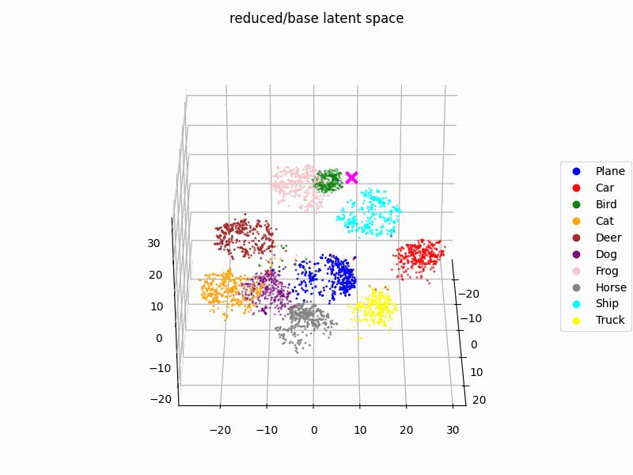
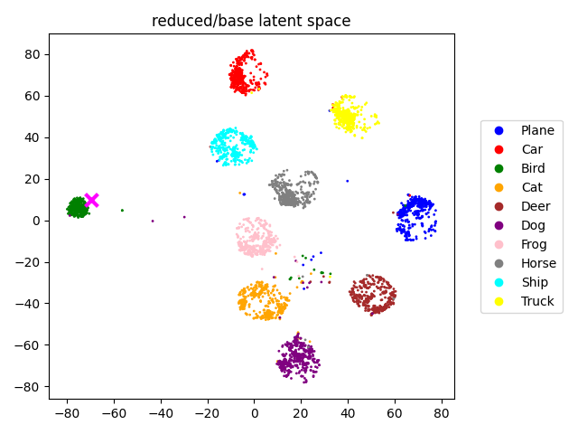

# SalUn DeepDive

Welcome to the **SalUn DeepDive** repository! This project is dedicated to the in-depth analysis and evaluation of [**SalUn**](https://arxiv.org/abs/2310.12508). The SalUn method is a novel approach in the field of machine learning that focuses on the unlearning process within neural networks using saliency masks. Our objective is to explore the inner workings of this technique and provide comprehensive insights into its effectiveness and implications.

In this project, we conduct various experiments to understand how salun impacts the learning and unlearning processes in neural networks. We delve into the method's mechanics, analyze its performance on different datasets, and evaluate its potential applications. By doing so, we aim to contribute valuable knowledge to the machine learning community and facilitate further research in this area.

Whether you are a researcher, student, or enthusiast interested in machine learning and neural networks, this repository offers valuable resources and findings related to the salun method. We encourage you to explore our analysis, experiment with the provided code, and contribute to the ongoing research.

<div align="center" style="display: flex;">
  
  
</div>

## What is SalUn?

blah blah blah

## Project Structure

```
├── exp
│   ├── classforget100.json
│   └── ...
├── features
│   └── ...
├── images
│   └── ...
├── base_test.py
├── datasets.py
├── feature_extraction.py
├── main.py
├── methods.py
├── metrics.py
├── wasserstein.py
├── requirements.txt
├── train.py
├── tsne_vis.py
├── utils.py
└── README.md
```

## Getting Started

Install the required dependencies by running:

```bash
pip install -r requirements.txt
```

To log your runs on Weights & Biases, you need to set your API key in a .env file. You can create a free account on [Weights & Biases](https://wandb.ai/) and get your API key from the settings page.

`.env`:

```bash
WANDB_SECRET="your_api_key"
```

If you don't intend to log via wandb you can run each command with the `-NL` flag to disable logging.

## Baselines

To train your base model just run:

```bash
python train.py
```

It's possible to use all models available via the `timm` library and we implemented our adaptations for the `cifar10`, `cifar100` and `svhn` datasets. Use `train.py -h` for a full list of the available arguments.

```
python train.py --model resnet18 --dataset cifar10 --lr 0.1
```

Will fully train a ResNet18 model on the CIFAR10 dataset with a learning rate of 0.1

```
python train.py --model resnet18 --dataset cifar100 --cf 7
```

Will train a ResNet18 model on the CIFAR100 dataset **excluding class 7**

```
python train.py --model resnet18 --dataset svhn --unlr 0.1
```

Will train a ResNet18 model on the SVHN dataset **excluding 10% of the training data**

Along each checkpoint will be generated a _.json_ file containing all the indexes of the samples that have been excluded from the training process.

If you intend to retrain a model using the same forget set as another run, you can provide the path to the json file using the `--itf` argument.

```
python train.py --model resnet18 --dataset svhn --itf checkpoints/resnet18_svhn_RF_forget.json
```

## Unlearning

Although it's possible to set up the unlearning process via command line, we strongly recommend loading the experiments from json files. The `exp` folder contains some of the experiments we ran for our tests.

```bash
python main.py -L exp/classforget.json --nexp 5
```

Will load all the experiments from the `classforget.json` file and the results will be averaged over 5 runs. Experiments are set up as a list or dictionaries:

```json
[
  {
    "class_to_forget": 0,
    "use_mask": false,
    "method": "rl_split"
  },
  {
    "class_to_forget": 0,
    "use_mask": true,
    "mask_thr": 0.2,
    "method": "rl_split"
  }
]
```

The possible parameters are:

- `checkpoint` _(str)_ : path to the model checkpoint
- `class_to_forget` _(int)_ : index of class to forget
- `unlearning_rate` _(float)_ : fraction of the training data to forget
- `idxs_to_forget` _(str)_ : path to the json file containing the indexes of the samples to forget
- `use_mask` _(bool)_: whether to use the saliency mask (i.e. **SalUn**)
- `mask_thr` _(float)_: threshold for the saliency mask
- `lr` _(float)_ : learning rate
- `epochs` _(int)_ : number of epochs
- `method` _(str)_ : unlearning method
- `tag` _(str)_ : tag for the experiment (useful for logging)

It's possible to choose between the following **methods**:

- `rl` : Random labeling of the training samples in one go
- `rl_split` : First runs random labeling on the forget set and then fine tunes the model on the retain set (method used in the **SalUn** paper)
- `ga` : Gradient ascent of the forget set samples and gradient descent of the retain set samples
- `ga_small` : Only performs gradient ascent on the forget set samples

You can apply the **SalUn** mask with any of the methods by setting `use_mask` to `True` and providing a threshold for the mask (default 0.5). Keep in mind the official implementation uses the `rl_split` method.

## Feature Extraction

In order to visualize and analyze the latent space of the models, you must first run the feature extraction script:

```bash
python feature_extraction.py -D reduced/base/ -S 5000
```

Will load all the checkpoints from the `reduced/base/` folder and extract the embeddings for the first 5000 samples of the training set. The embeddings will be saved in a `.json` along the corresponding labels and the prototypes of each class.

## Visualization

To visualize the embeddings you must first define the features containing folders you want to visualize in the `tsne_vis.py` script:

```python
    folders = [
        "features/reduced/base",
        "features/reduced/rl_split",
    ]
```

Then you can run the script specifying the number of samples to visualize:

```bash
python tsne_vis.py -S 3000
```

2D, 3D and animated T-SNE plots will be generated for each of the json files in the specified folders and saved in the `images` directory creating a folder structure mirroring the features' directory.

It's also possible to generate the **Wasserstein distance** confusion matrices by running:

```bash
python wasserstein.py -S 1000
```

## Authors

- [@lorenzoorsingher](https://github.com/lorenzoorsingher)
- [@vincenzonetti](https://github.com/vincenzonetti)
- [@blauer4](https://github.com/blauer4)

[GitHub repo](https://github.com/lorenzoorsingher/SalUn_DeepDive)
